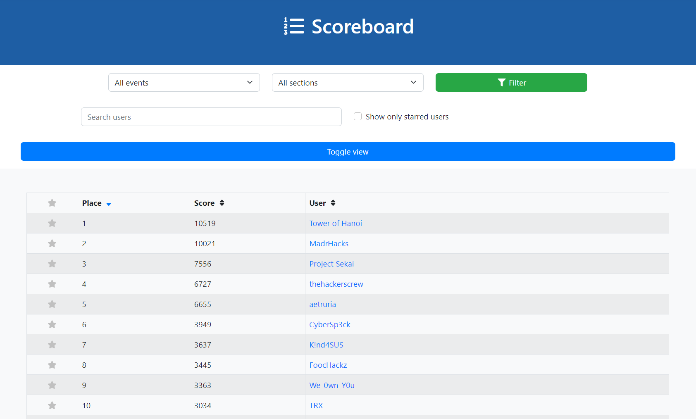

# Srdnlen CTF 2023

Srdnlen CTF 2023 is the second edition of the online Jeopardy-style Capture-The-Flag competition hosted by the members of [Srdnlen](https://srdnlen.unica.it/), an italian team based in Sardinia, supported by the italian [Cybersecurity National Laboratory](https://cybersecnatlab.it/).

   

The competition marks the first round of the second edition of [CyberCup](https://cybercup.it), an Italian CTF tournament.

- [CTFtime event](https://ctftime.org/event/2129/)

## Challenges

| Category   | Title                                                      | Author                                                                           | Dynamic            | Type  | Url                                | Port  |
| :--------- | :--------------------------------------------------------- | :------------------------------------------------------------------------------- | :----------------: | ----: | ---------------------------------: | :---: |
| crypto     | [BabyOrNot](crypto_BabyOrNot)                              | Lorenzo Siriu <@lrnzsir>                                                         | :heavy_check_mark: | tcp   | babyornot.challs.srdnlen.it        | 1338  |
| crypto     | [L337tery](crypto_L337tery)                                | Lorenzo Siriu <@lrnzsir>                                                         | :heavy_check_mark: | tcp   | l337tery.challs.srdnlen.it         | 1337  |
| crypto     | [MPDH](crypto_MPDH)                                        | Lorenzo Siriu <@lrnzsir>                                                         | :x:                |       |                                    |       |
| crypto     | [RSA](crypto_RSA)                                          | Lorenzo Siriu <@lrnzsir>                                                         | :x:                |       |                                    |       |
| crypto     | [RSB](crypto_rev_RSB)                                      | Davide Sechi <@chRistianoDeveloper>, Nicholas Meli <@uNickz>                     | :heavy_check_mark: | tcp   | rsb.challs.srdnlen.it              | 1339  |
| foren      | [MemHunt - LEVEL 1](foren_MemHunt1)                        | Silvia Lucia Sanna <@slsanna>                                                    | :x:                |       |                                    |       |
| foren      | [MemHunt - LEVEL 2](foren_MemHunt2)                        | Silvia Lucia Sanna <@slsanna>                                                    | :x:                |       |                                    |       |
| foren      | [MemHunt - LEVEL 3](foren_MemHunt3)                        | Silvia Lucia Sanna <@slsanna>                                                    | :x:                |       |                                    |       |
| foren      | [MemHunt - LEVEL 4](foren_MemHunt4)                        | Silvia Lucia Sanna <@slsanna>                                                    | :x:                |       |                                    |       |
| osint      | [OSiMt](foren_OSINT)                                       | Alessandro Carlo Melis <@cvrlx>                                                  | :x:                |       |                                    |       |
| network    | [Urban Odissey](foren_Urban%20Odyssey)                       | Aurora Arrus <@anauroranon>                                                      | :x:                |       |                                    |       |
| misc       | [Audio misc challenge](foren_audioChall)                   | Luca Damiano <@lVitaD>                                                           | :x:                |       |                                    |       |
| misc       | [stego WarmUp](foren_easySteg)                             | Luca Damiano <@lVitaD>                                                           | :x:                |       |                                    |       |
| misc       | [ISAbel](foren_grandma)                                    | Alessandro Carlo Melis <@cvrlx>                                                  | :x:                |       |                                    |       |
| foren      | [sardCastle](foren_sardCastle)                             | Pietro Crabu <@pc98>                                                             | :x:                |       |                                    |       |
| gamepwn    | [My_first_game!](gamePwn_my_first_game!)                   | Massimo Sanna <@SannaZ>                                                          | :x:                |       |                                    |       |
| hardware   | [GTD](hw_GTD_grand_theft_data)                             | Simone Cocco <@simonecocco>, Lorenzo Siriu <@lrnzsir>, Simone Sulis <@salsa>     | :heavy_check_mark: | tcp   | gtd.challs.srdnlen.it              | 42069 |
| hardware   | [FatalABS](hw_fatalabs)                                    | Simone Cocco <@simonecocco>                                                      | :x:                |       |                                    |       |
| misc       | [Ajaja sa Chef](misc_Ajaja_sa_Chef)                        | Salvatore Castello <@SalvaCà>                                                    | :x:                |       |                                    |       |
| foren      | [Flappy](misc_Flappy)                                      | Salvatore Castello <@SalvaCà>                                                    | :x:                |       |                                    |       |
| misc       | [PyLogger](misc_PyLogger)                                  | Luca Minnei <@minn3>                                                             | :x:                |       |                                    |       |
| misc       | [The Impossible Escape](misc_The_Impossible_Escape)        | Nicholas Meli <@uNickz>                                                          | :heavy_check_mark: | tcp   | tie.challs.srdnlen.it              | 1734  |
| blockchain | [Free Real Estate](misc_free_real_estate)                  | Matteo Cornacchia <@zoop>                                                        | :heavy_check_mark: | tcp   | fre.challs.srdnlen.it              | 8546  |
| misc       | [Improvise Adapt Overcome](mlsec_improvise_adapt_overcome) | Maura Pintor <@maurapintor>, Lorenzo Pisu <@pysu>, Silvia Lucia Sanna <@slsanna> | :heavy_check_mark: | http  | adapt.challs.srdnlen.it            | 80    |
| pwn        | [PwnTube](pwn_PwnTube)                                     | Emmanuele Massidda <@manu_massi>                                                 | :heavy_check_mark: | tcp   | pwntube.challs.srdnlen.it          | 1661  |
| pwn        | [Google En Passant](pwn_google_en_passant)                 | Matteo Cornacchia <@zoop>                                                        | :heavy_check_mark: | tcp   | gep.challs.srdnlen.it              | 1660  |
| pwn        | [Sweet Sixteen](pwn_sweet_sixteen)                         | Davide Maiorca <@astralXploit0>                                                  | :heavy_check_mark: | tcp   | sweet16.challs.srdnlen.it          | 1616  |
| rev        | [Koenigsberg](rev_koenigsberg)                             | Matteo Cornacchia <@zoop>                                                        | :x:                |       |                                    |       |
| android    | [SrdnAuth](rev_srdnauth)                                   | Daniele Pintore <@ex0g3n>                                                        | :x:                |       |                                    |       |
| web        | [Breaking News](web_breaking_news)                         | Christian Scano <@DarkKnight>, Diego Soi <@DieSoi>                               | :heavy_check_mark: | http  | breaking-news.challs.srdnlen.it    | 80    |
| web        | [My Bidda](web_my_bidda)                                   | Lorenzo Pisu <@pysu>                                                             | :heavy_check_mark: | http  | mybidda.challs.srdnlen.it          | 80    |
| web        | [pugwar](web_pugwar)                                       | Federico Loi <@Octaviusss>                                                       | :heavy_check_mark: | http  | pugwar.challs.srdnlen.it           | 80    |
| web        | [Sardinian Dishes](web_sardinian_dishes)                   | Lorenzo Pisu <@pysu>                                                             | :heavy_check_mark: | http  | sardinianrecipes.challs.srdnlen.it | 80    |
| web        | [Spongeweb](web_spongeweb)                                 | Matteo Sanna <@sanmatte>                                                         | :heavy_check_mark: | http  | spongeweb.challs.srdnlen.it        | 80    |

## Final scoreboard

### Top 10

### Full scoreboard

- [Full scoreboard](images/scoreboard.png)
- [Solves](images/solves.png)
