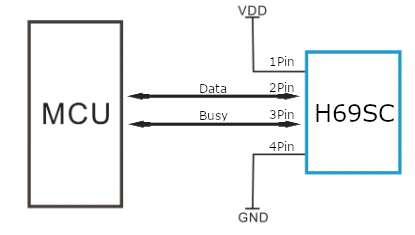

# H69SC Humidity

H69SC Humidity sensor features a humidity sensor complex with a calibrated digital signal output.

## 1. Introduction

H69SC Humidity sensor features a humidity sensor complex with a calibrated digital signal output. By using the exclusive digital-signal-reliability and excellent long-term stability. This sensor includes a resistive-type humidity measurement component and connects to a high-performance 8-bit microcontroller, offering excellent quality, fast response, anti-interference ability and cost-effectiveness.

Each H69SC element is strictly calibrated in the laboratory that is extremely accurate on humidity calibration. The calibration coefficients are stored as programmes in the OTP memory, which are used by the sensor's internal signal detecting process. The communication protocol interface makes system integration quick and easy. Its small size, low power consuption and up-to-20 meter signal transmission making it the best choice for various applications, including those most demanding ones. The component is 4-pin single row pin package. It is convenient to connect and special packages can be provided according to users' request.

## 2. Technical Specifications:
### Overview
Item|Measurement range|Humidity accuracy| Resolution|Package
---|---|---|---|---
H69SC|20-90%RH|±5％RH|1|4 pin single row

### Detailed specifications:
Parameters|Conditions|Minimum|Typical|Maximum
---|---|---|---|---
Humidity resolution||1%RH|1%RH|1%RH
Repetability|||±1%RH
Accuracy|25°C||±4%RH|
Accuracy|0-50°C|||±5%RH
Interchangeability|Fully
Measurement range #1|0°C|30%RH||90%RH
Measurement range #2|25°C|20%RH||90%RH
Measurement range #3|50°C|20%RH||80%RH
Response time [seconds]|1/e(63%)25°C， 1m/s Air||Instantaneous|
Hysteresis|||±1%RH
Long-term stability|Typical||±1%RH/year

## 3. Typical application (Figure 1)

### Figure 1 Typical Application
> Note: 4Pin; MCU = Micro-computer Unite or single chip Computeer

## 4. Power and Pin
H69SC's power supply is 3-5.5V. When power is supplied to the sensor, do not send any instruction to the sensor in within one second in order to pass the unstable status. One capacitor valued 100nF can be added between VDD and GND for power filtering.

## 5. Communication process: serial interface (Double wire Two-Way)
Double-bus data format is used for communication and synchronization between MCU and H69SC sensor. one communication process is about 4ms.

Data consist of instruction and data. A complete data transmission is 16bit, and the sensor sends lower data bit first.

How the data should be sended: 8 bit instruction + 8 bit parameter; each bit value is acquired when pin 2 value is raising.

### 5.1 Overall communication process
When MCU sends a start signal, H69SC changes from the low-power-consuption mode to the running-mode, waiting for MCU completing the start signal. Is possible to set the sensor to be always ready to send.

### 5.2 MCU sends out start signal to H69SC
To activate the sensor, it needs a signal combination. The table below has the values in order to understand the sequence.
Time|Busy|Data
---|---|---
T|0|1
T+1|1|1
T+2|0|1
T+3|1|0

### 5.3 MCU sends instruction to H69SC
H69SC works with little commands in 2 byte format. The highest part contain the instruction (15 to 8 bits), the lowest part the value associated (7 to 0).
The bits from 11 to 8 are ignored.

To know what instruction are supported, see the table of instruction below.

Name|OPCODE|Description
---|:---:|---
SET SRC REG|1010|Set source register address
SET DST REG|1011|Set destination register address
GET SRC REG|1110|Get SRC REG value
GET DST REG|1111|Get DST REG value
SET PARAM REG|1000|Set value of param register
GET PARAM REG|1001|Get PARAM REG value
MOVE|0100|Move value from address pointed by SRC into the register pointed in DST
CLEAR|0001|Clear param register
AND|0010|Execute and operation between src and dst register; save result into dst register
OR|0011|Execute or operation between src and dst register; save result into dst register
NOT|0101|Execute not operation on dst register
GETV|0110|Get humidity value

**List of registers avaiable**
Name|Addreds|Description|Default value
---|:---:|---|:---:
A|01000100|General purpose register A|0
B|01000010|General purpose register B|0
ORDER|01001100|Byte sending order|Big endian
MODE|10001100|Measurement mode|8bit size
DELAY|00000111|Time to wait before answering|0
POWER SAVE|00000001|Power save mode|SAVE
PARAM|00000011|Register for parameter, directly accessible from OPCODE|0

### 5.4 H69SC sends responde to MCU
H69SC sends various type of response: depends of it is configured. Each configuration have in common a response len of 16bit (or 2 byte).

To know what is sended by the sensor, see the tables in the next section.

### 5.5 Register values
**DELAY values**

The values accepted by delay register are unsigned char (1 byte).

**POWER SAVE values**
Name|Hex value|Description
--|:---:|---
SAVE|0x10|Require to be woke (view section 5.2 to know how to wake up)
ALWAYS_ACTIVE|0x69|The sensor is always ready

**ORDER values**
Name|Hex value|Description
--|:---:|---
Little endian|0x10|Set the byte order to little endian
Big endian|0x20|Set the byte order to big endian

**MODE values**
Name|Hex value|Description
--|:---:|---
8bit|0x10|The values are converted between 0 and 255
16bit|0x20|The values are converted between 0 and 65535

## 6. Electrical characteristics
VDD = 5V, TA=25°C (unless otherwise stated)
Description|Type|Minimum|Typical|Maximum
---|---|---|---|---
Power supply|DC|3V|5V|5.5V
Current supply|Measuring|0.5mA||2.5mA
Current supply|Average|0.2mA||1mA
Current supply|Standby|100uA||150uA
Sampling period [seconds]||1ns||

## 7. Attentions of application
### (1) Operating conditions
Applying the H69Sc sensor beyond its working range stated in this datasheet can result in 3%RH signal shift/discrepancy. The H69SC sensor can recover to the calibrated status gradually when it gets back to the normal operating condition and works whithin its range. Please refer to (3) of this section to accelerate its recovery. Please be aware that operating the H69SC sensor in the non-normal working conditions will accelerate sensor's aging process.

### (2) Attention to chemical materials
Vapor from chemical material may interfere with H69SC's sensitive-elements and debase its sensitivity. A high degree of chemical contamination can permanently damage the sensor.

### (3) Restoration process when (1) & (2) happen
1. Step one: keep the H69SC sensor at the condition of temperature 50-60°C, humidity <10%RH for 2 hours;
2. Step two: keep the H69SC sensor at the condition of temperature 20-30°C, humidity >70%RH for 5 hours.

### (4) Connection wires
The quality of connection wires will affect the quality and distance of communication and high quality shielding-wire is recommended.
