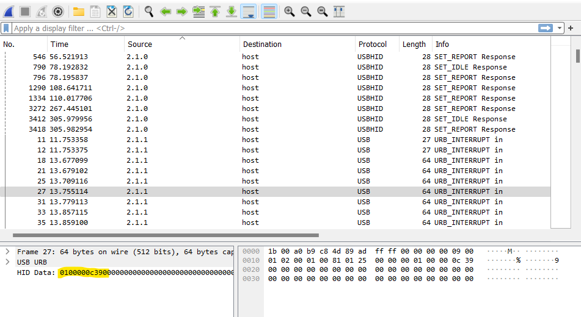
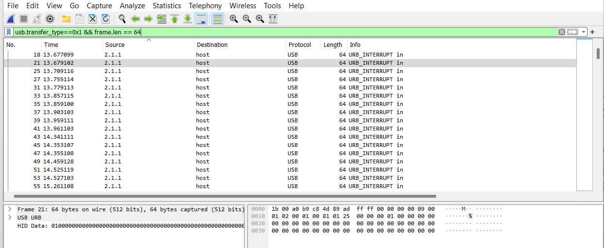
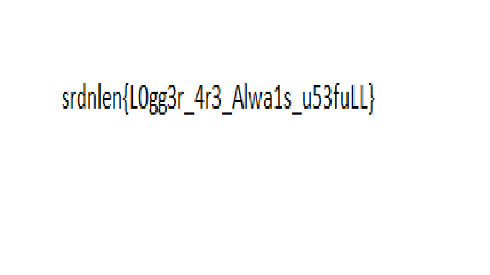

# PyLogger

> An hacker was able to encode my files but I don't know how.
> 
> 
> Fortunately I was able to recover what he types on the keyboard.
> 
> Can you help me to decode my files?

# Solution

---

the challenge has two different files the first is a USB stream analyzing the PCAP you can see that one of the input devices connected is a keyboard, and we can retrieve all the keys typed.

then you can collect the Leftover Capture data and convert the data to the relative keyboard key.

what you can do now is to filter only the packet from the keyboard and export that packet with wireshark.

now you can write a Python script that parses all the packets to retrieve what the user was writing.

if your script is correct you will discover that the attacker wrote a Python script that does a base64 encode and then shift all the bytes of -4 of a specified file. to do the reverse operation you have to shift all the characters of +4, you can do that part with an online tool like “[https://www.dcode.fr/ascii-shift-cipher](https://www.dcode.fr/ascii-shift-cipher)”, and then apply the base 64 decoding.

doing the reverse operation you will find a PNG image with the flag.

---
