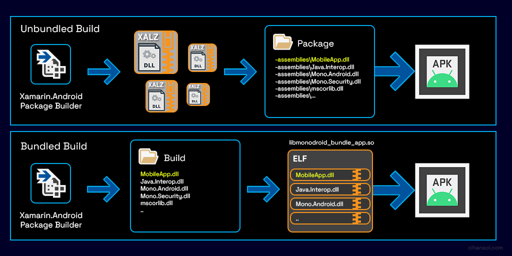
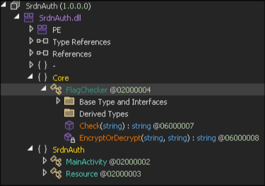

# SrdnAuth   
   
The challenges provide us a apk file, if we try to open it with `jadx` and check the `MainActivity` we see that it calls only a native method, nothing else:   
```java
private native void n_onCreate(Bundle bundle);
....
public void onCreate(Bundle bundle) {
	n_onCreate(bundle);
}
```
Since jadx can't provide any useful information we can decompile the apk with apktool and check the lib folder. Here we can see a lot of libraries, having a closer look at them we can see that our application uses `Xamarin` and appears that uses `Ahead Of Time (AOT)` libraries. This means that the `dll` is compiled in native code in order to save some execution time.    
```
...
libaot-Xamarin.AndroidX.Activity.dll.so
libaot-SrdnAuth.dll.so
...
libmonodroid_bundle_app.so
libmonodroid.so
libmono-native.so
libmonosgen-2.0.so
libxa-internal-api.so
libxamarin-app.so

```
Now we need to have a look at how Xamarin works on android applications. [This](https://cihansol.com/blog/index.php/2021/08/09/unpacking-xamarin-android-mobile-applications/) small article explains the basics, I suggest to have a look at it. But for the lazy people here a small summary:   
    
Looking our file structure we are in the bundled build scenario.   
You may be tempted to reverse directly the library, for example you can try to understand what `libaot-SrdnAuth.dll.so` does but this is complicated because you are reversing a `C#` library compiled for `arm64`. There is an alternative path: you can use some tools to extract the dll files from `libmonodroid\_bundle\_app.so` and then you can reverse them. I'll suggest [this](https://github.com/danielepintore/xamarin_patcher/releases/tag/v0.1.0) tool, it is very simple to use:   
```
./xamarin_patcher extract libmonodroid_bundle_app.so dlls
```
Now in the dlls directory we can find all the dlls and we can use a tool like [dnSpy](https://github.com/dnSpyEx/dnSpy) to have a look at them. Let's have a look at `SrdnAuth.dll`:   
    
Here the structure with a class called `FlagChecker`, let's check what is inside:   
```C#
using System;
using System.Text;

namespace Core
{
	public static class FlagChecker
	{
		public static string Check(string flag)
		{
			byte[] array = new byte[]
			{
				68, 85, 51, 10, 42, 19, 71, 59, 88, 96,
				47, 27, 73, 89, 9, 31, 66, 30, 81, 32,
				82, 97, 15, 51, 7, 84, 74, 6, 98, 89,
				120, 51, 84, 50, 41, 71, 115, 91, 46
			};
			string text = "7'WdFv)@/Spwy/:@vp5RbPkl3$:YS";
			string @string = Encoding.ASCII.GetString(array);
			string text2 = FlagChecker.EncryptOrDecrypt(@string, text);
			if (text2.Equals(flag))
			{
				return "Output:    Correct flag!!";
			}
			return "Output:    Wrong Flag!!!";
		}

		private static string EncryptOrDecrypt(string text, string key)
		{
			StringBuilder stringBuilder = new StringBuilder();
			for (int i = 0; i < text.Length; i++)
			{
				stringBuilder.Append(text.get_Chars(i) ^ key.get_Chars(i % key.Length));
			}
			return stringBuilder.ToString();
		}
	}
}

```
Having a look at `EncryptOrDecrypt` function we can see that is a simple `xor` encryption. The `EncryptOrDecrypt` function is called with the string generated from the byte array `array` and text as `key`. Now we write a simple python script to do the decryption and we should have the flag.   
```python3
from itertools import cycle


def xor(data, key):
    return "".join([chr(ord(c1) ^ ord(c2)) for (c1, c2) in zip(data, cycle(key))])


def run():
    flag_enc = bytes([68, 85, 51, 10, 42, 19, 71, 59, 88, 96, 47, 27, 73, 89, 9,
                      31, 66, 30, 81, 32, 82, 97, 15, 51, 7, 84, 74, 6, 98, 89,
                      120, 51, 84, 50, 41, 71, 115, 91, 46])
    key = "7'WdFv)@/Spwy/:@vp5RbPkl3$:YS"
    flag_enc_str = flag_enc.decode('ascii')
    print(xor(flag_enc_str, key))


if __name__ == "__main__":
    run()
```
That gives us the flag: `srdnlen{w3_l0v3_4ndr01d_4pp_1n_d0t_n3t}`   
